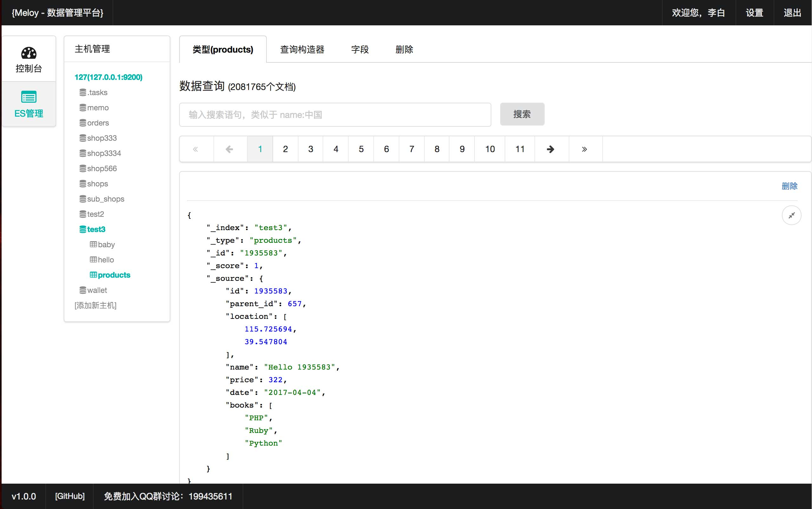
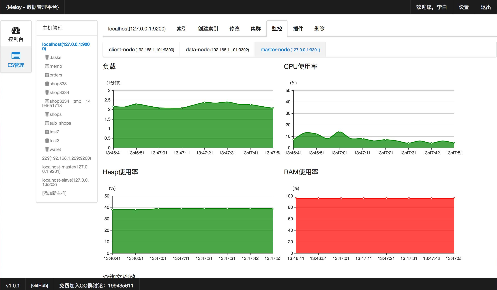

# Meloy数据管理平台
Meloy[ˈmelə]提供ES(Elastic Search)等数据管理工具框架，可以方便地植入数据相关管理工具。

# Meloy命名由来
* *M* 管理（Manage）
* *E* 萃取（Extract）
* *L* 学习（Learn）
* *O* 优化（Optimize）

# 安装需求
* PHP7及以上版本
* pdo扩展
* pdo_mysql扩展
* curl扩展
* json扩展(一般内置)

# 安装方法

## 最快启动方法
在命令行下执行：
~~~
cd meloy/
php -S localhost:3000
~~~

如有需要把其中的`php`和`localhost`、端口`3000`换成你自己的，然后即可在浏览器中访问
~~~
http://localhost:3000
~~~

## nginx和apache
直接将 *meloy/* 放到网站目录下即可访问。

## 默认登录账号
默认登录邮箱为`root@meloy.cn`，你可以在安装过程中修改。

## 预览图
### 查询数据

### 监控
