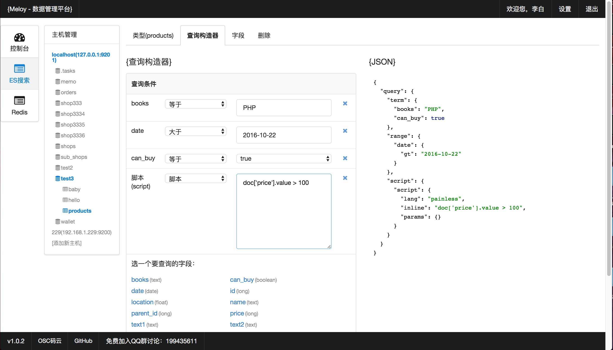
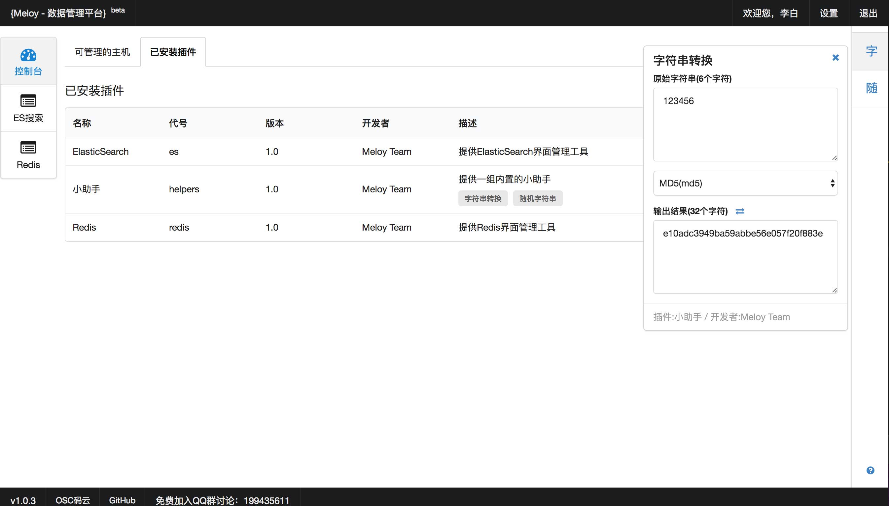

# Meloy数据管理平台
**Meloy** *[ˈmelə]* 基于PHP7提供ES(Elastic Search)、Redis等数据管理工具框架，可以方便地植入数据相关管理工具。

# Meloy命名由来
* *M* 管理（Manage）
* *E* 萃取（Extract）
* *L* 学习（Learn）
* *O* 优化（Optimize）

# 安装需求
* **PHP7及以上版本**
* pdo扩展
* pdo_mysql扩展
* curl扩展
* json扩展(一般内置)
* redis扩展(Redis模块使用)

# 安装方法

## 最快启动方法
在命令行下执行：
~~~
cd meloy/
php -S localhost:3000
~~~

如有需要把其中的`php`和`localhost`、端口`3000`换成你自己的，然后即可在浏览器中访问
~~~
http://localhost:3000
~~~

## nginx和apache
直接将 *meloy/* 放到网站目录下即可访问：
~~~
http://你的网站/meloy/
~~~

## 默认登录账号
默认登录邮箱为`root@meloy.cn`，你可以在安装过程中修改。

# 升级方法
删除 *app/configs/db.php* 再次访问系统首页的时候，会自动进入安装程序，旧的数据会被保留，不会丢失。

# QQ群
交流QQ群：199435611

# 预览图
## 查询数据

## 查询构造器

## 监控

## 编程小助手

# 使用的开源技术
* [PHP](http://php.net/) - 可能是世界上最好的编程语言（哈哈😆）
* [MySQL](https://www.mysql.com/) - 可能是最流行的开源RDBS数据库
* [Semantic UI](https://semantic-ui.com/) - 一套很好用的UI
* [AngularJS](https://angularjs.org/) - 稳定的前端数据处理框架
* [highlight.js](https://highlightjs.org/) - 代码高亮工具
* [echarts](http://echarts.baidu.com/) - 百度出品的图表库
* [jQuery](http://jquery.com/) - 强大的DOM操作工具

# 开发路线图
| Phase        | Work           | 
| ------------- |:-------------:|
| P1 | 简单的基础框架+ES、Redis模块 |
| P2 | 提供框架规范，更完善的基础设施，接入更多的模块 |
| P3 | 提供API支持微服务，简化数据服务开发 |

# 协议
[The New BSD License](http://baike.baidu.com/item/BSD%E5%8D%8F%E8%AE%AE)
